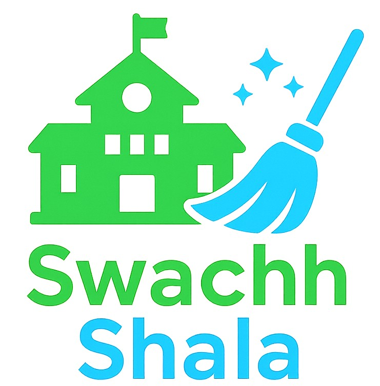
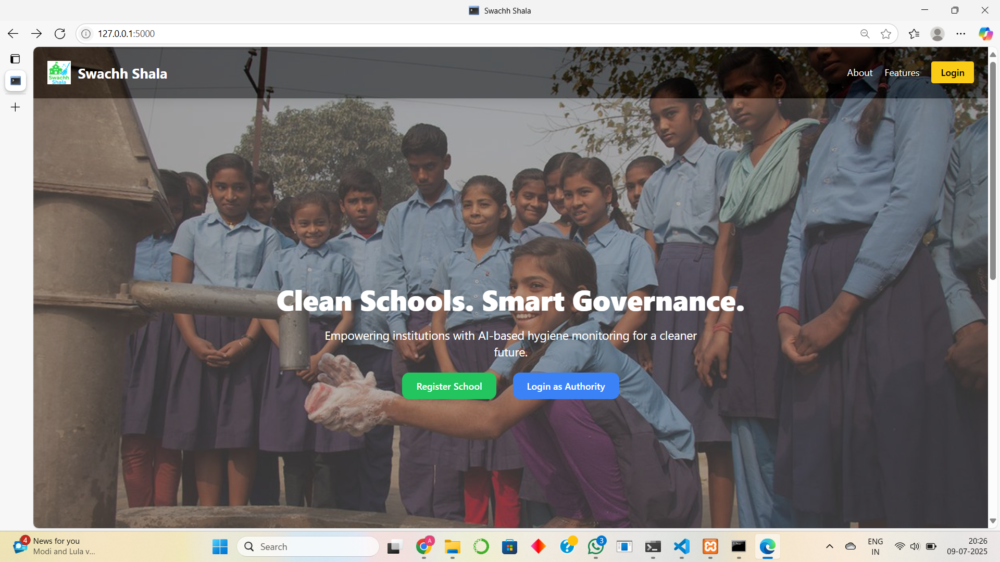
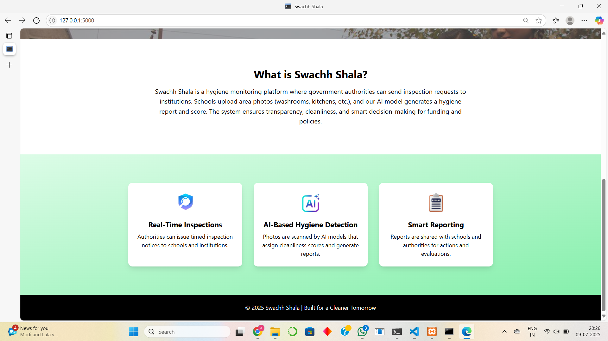
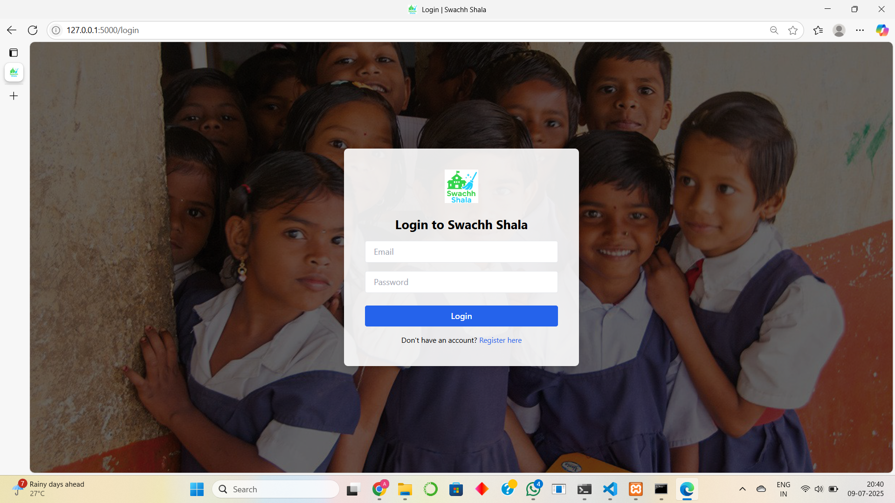
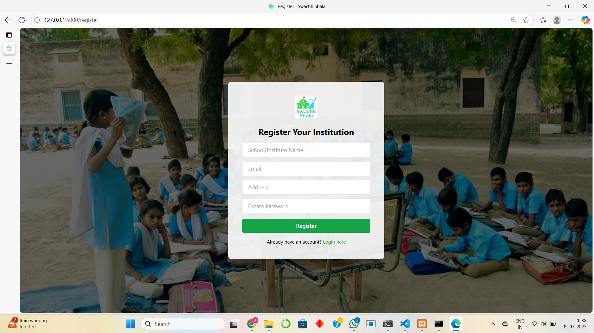
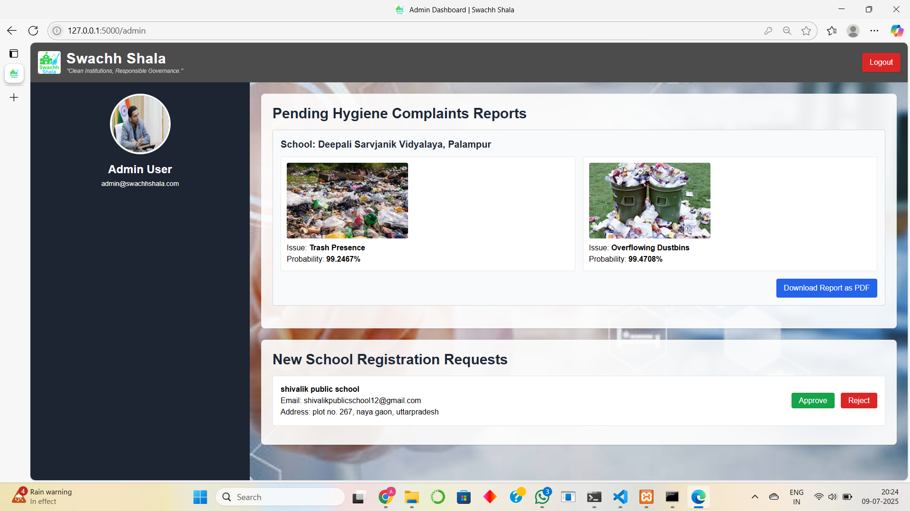
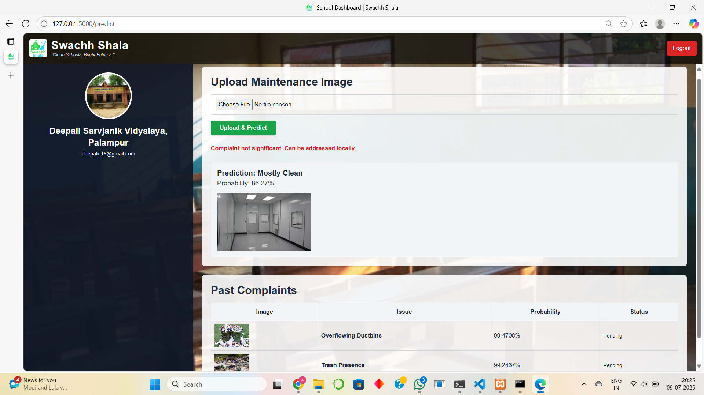

<div align="center">
  
  <h1>Swachh Shala 🏫✨</h1>
  <p><em>"Clean Schools, Bright Futures"</em></p>
</div>

---

## 📖 Project Overview  

🧼 *Swachh Shala* is an AI-powered hygiene inspection and complaint management platform built for *government and public schools. It ensures timely identification of hygiene issues using **image-based AI classification**, automates complaint reporting, and streamlines school registration for state authorities.

The platform enables:
- 📸 *AI-based detection* of hygiene irregularities from school-uploaded images  
- 📝 *Complaint management and reporting* for institutions  
- 🗂 *Admin control over registration and complaint validation*  
- 📄 *On-demand PDF hygiene reports* for any institution  
- 🏫 Transparent, data-driven hygiene inspections for policy improvement  

---

## ❗ Problem Statement  

> In many public schools across India, hygiene management lacks proper infrastructure monitoring, and inspections are sporadic.  
> Poor sanitation, overflowing dustbins, water leaks, and unclean floors often remain unnoticed, affecting student health.  
> Manual inspections are time-consuming, inconsistent, and paperwork-heavy.

---

## 💡 Our Solution  

✅ An AI-powered platform where:
- Schools upload images of problem areas (toilets, bins, floors)
- AI classifies the issue and assigns a probability score  
- If critical (≥ 75%), it automatically logs a complaint for admin review  
- Admin can verify, accept, reject, and generate hygiene inspection reports  
- Schools can track past complaints and re-upload images anytime

---

## ⚙ Tech Stack  

| 🖥 Frontend            | 🛠 Backend             | 📦 AI Model              | 📊 Database |
|:----------------------|:----------------------|:------------------------|:------------|
| HTML5, CSS3, TailwindCSS | Flask (Python)         | TensorFlow (CNN Classifier) | MySQL via XAMPP |
| Javascript (dynamic UI) | xhtml2pdf (PDF reports) | Keras .keras model     |             |

---

## 📋 Features  

- 📸 AI-powered hygiene issue classification (4 categories)
- 🔐 School registration system with admin approval  
- 🏫 School dashboard to upload images, track complaints  
- 📥 Admin dashboard to manage complaints and school requests  
- 📄 Generate PDF inspection reports with AI analysis + impact notes  
- 🎨 Fully responsive, themed UI with branded background images  
- 📊 Transparent complaint logs with issue images, classification, probability, and status  

---

## 👑 Admin Privileges  

✅ View all pending complaints from schools  
✅ Approve or reject new school registration requests  
✅ Download AI-generated hygiene inspection reports in PDF  
✅ Oversee complaint logs with school-wise grouping  

---

## 🏫 School Privileges  

✅ Upload images for hygiene issue detection  
✅ Receive AI-generated issue classification and probability  
✅ View past complaints and status updates  
✅ Access clean, intuitive school dashboard  

---

## 📦 Prerequisites  

✅ Python >= 3.10 (not 3.13+)  
✅ MySQL via *XAMPP* (Apache + MySQL running)  
✅ Python Packages:

#### Execute the following steps

### 📦 requirements.txt
```bash
flask
tensorflow==2.16.1
numpy
Pillow
xhtml2pdf
mysql-connector-python
```

Place the text into `requirements.txt` and run the command given below.

```bash
pip install -r requirements.txt
```

### 🚀 Run the Project
```bash
python app.py
```

### 📌 Access your app at
```bash
http://localhost:5000/
```

---

## 🖥 Project Structure
```bash
project/
├── app.py                       # 📌 Main Flask application file (routes, views, AI prediction logic)
├── db_config.py                 # 📌 Database connection setup file (MySQL config with XAMPP)
│
├── model/                       # 📂 Folder for storing AI/ML models
│   └── hackorbitmodel.keras     # 📌 Pre-trained TensorFlow Keras model for hygiene issue classification
│
├── static/                      # 📂 Static assets (images, uploads, logos, backgrounds, etc.)
│   ├── uploads/                 # 📂 Folder where uploaded complaint images are saved dynamically
│
├── templates/                   # 📂 All HTML templates (Jinja2 compatible with Flask)
│   ├── index.html               # 📌 Landing page of the portal (project overview + login/register links)
│   ├── register.html            # 📌 Registration form page for schools
│   ├── login.html               # 📌 Login page for both admin and registered schools
│   ├── admin_dashboard.html     # 📌 Admin’s main dashboard (pending complaints, school requests)
│   ├── user_dashboard.html      # 📌 School’s personal dashboard (upload images, view complaint history)
│   └── report_template.html     # 📌 Template for report generation, option available at admin dashboard
│
└── requirements.txt             # 📌 Python package dependencies needed to run the project
```

---

## 📈 Impact
- ✔ Cleaner, smarter government schools
- ✔ Reduces manual inspection load
- ✔ Protects student health via data-driven hygiene audits
- ✔ Transparency between schools and authorities

---

## 📸 UI Preview

---

### 🏠 Home Page

<p align="center">
  
  <br><br>
  
</p>

---

### 🔐 Login Page

<p align="center">
  
</p>

---

### 📝 Register Page

<p align="center">
  
</p>

---

### 🛡 Admin Dashboard

<p align="center">
  
</p>

---

### 🏫 School / Inspection Team Dashboard

<p align="center">
  
</p>

---
<br>

## ✨ Future Scope
- 📊 Hygiene scoring dashboards
- 📱 PWA or mobile app
- 📝 Push notifications
- 📈 AI retraining portal

---

### 👥 Team Swachh Shala
Built with ❤ to make schools cleaner, safer, and smarter.

---
## 📞 Help & Contact  

> 💬 *Got a question, suggestion, or need help with Swachh Shala?*  
> We’re here to assist and collaborate!

<div align="center">

<b>👤 Abhay Kanojia</b>  
<a href="https://www.linkedin.com/in/abhay-kanojia-0461a3341">
  
</a>  

<br/>

<b>👤 Deepali Chauhan</b>  
<a href="https://www.linkedin.com/in/deepali-chauhan-b7881230b?utm_source=share&utm_campaign=share_via&utm_content=profile&utm_medium=android_app">
  
</a>

</div>
